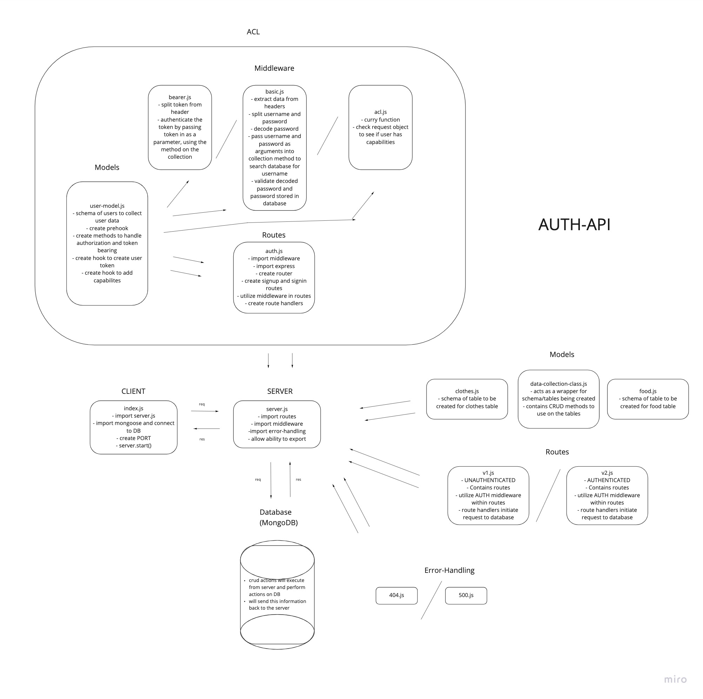

# LAB - Class 08

## Project: Auth API

### Author: Jenner Dulce

### Links and Resources

- [ci/cd](https://github.com/jennerdulce/auth-api/actions) (GitHub Actions)
- [Pull Request](https://github.com/jennerdulce/auth-api/pull/2)
- [HEROKU App](https://jennerdulce-auth-api.herokuapp.com/)

### Setup

#### `.env` requirements (where applicable)

- `PORT` - 3000
- `MONGODB_URI` - mongodb://localhost:27017/generalGood
- `SECRET`

#### How to initialize/run your application (where applicable)

- `nodemon`
- `node index.js`
- `npm start`

#### How to use your library (where applicable)

#### Tests

##### Routes

- POST /signup creates a new user and sends an object with the user and the token to the client
- POST /signin with basic authentication headers logs in a user and sends an object with the user and the token to the client

- POST /api/v2/:model with a bearer token that has create permissions adds an item to the DB and returns an object with the added item
- GET /api/v2/:model with a bearer token that has read permissions returns a list of :model items

- PUT /api/v2/:model/ID with a bearer token that has update permissions returns a single, updated item by ID

- DELETE /api/v2/:model/ID with a bearer token that has delete permissions returns an empty object. Subsequent GET for the same ID should result in nothing found

#### UML

;

#### Collaborations

- Mark Duenas
